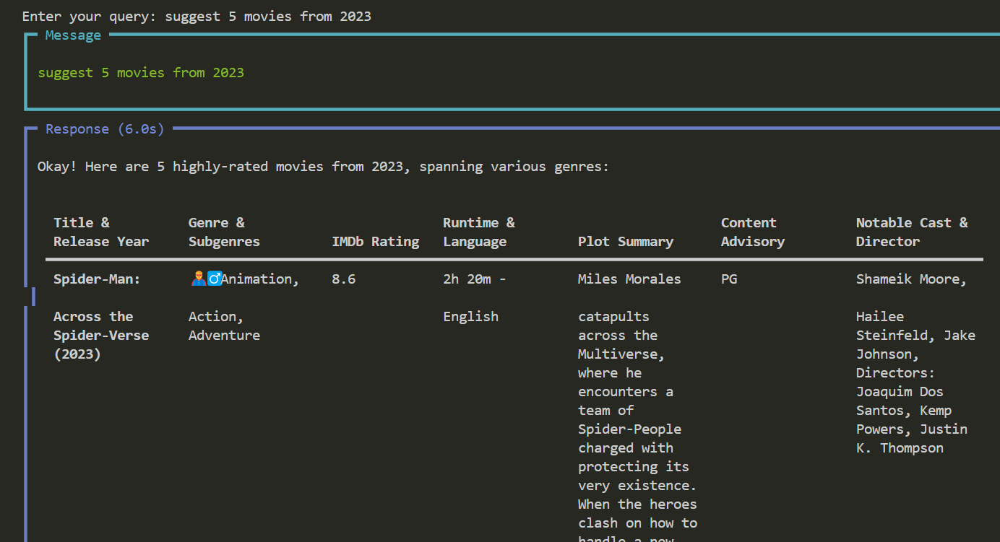
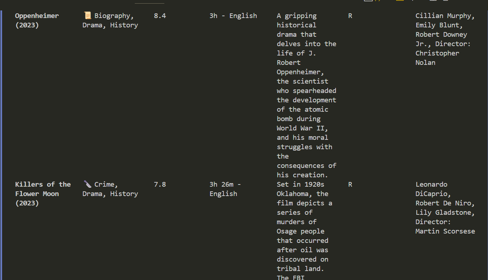

# Movie Recommendation Agent

## Overview
The Movie Recommendation System is a personalized agent designed to help users discover movies based on their preferences. The system leverages web search and language models (LLMs) to provide curated recommendations for movies across various genres and categories. It aims to offer tailored suggestions that match the user's taste, ensuring a high-quality movie-watching experience.

## Objective
The primary goal of this project is to:

1. Understand the user's movie preferences via natural language input.
2. Use web search (via EXA) to find the best movie options.
3. Provide personalized movie recommendations by analyzing:
   - Movie title & release year
   - Genre & subgenres with emoji indicators
   - IMDb ratings (7.5+ rated films)
   - Runtime & primary language
   - Engaging plot summary
   - Content advisory / age rating
   - Notable cast & director

## Tools Used
1. **Gemini (LLM)**
   - Model: gemini-2.0-flash-exp
   - The Gemini model is used for processing user queries and providing personalized recommendations based on movie data retrieved.

2. **EXA**
   - EXA is used as the tool for performing web searches to gather movie data from external sources.
   - It helps the system to identify relevant movies based on user queries and preferences.

## Project Flow
1. **User Input:**
   - The user inputs a query asking for movie recommendations (e.g., "I want to watch a horror movie").

2. **Web Search:**
   - EXA performs a web search to gather a list of relevant movies based on the user's query.

3. **LLM Processing:**
   - The extracted movie data is passed through the Gemini LLM.
   - Gemini processes the movie data and enhances the recommendations by personalizing them based on:
     - Movie title & release year
     - Genre & subgenres (with emojis)
     - IMDb ratings (focus on movies with 7.5+ ratings)
     - Runtime & language
     - Plot summary
     - Content advisory / age ratings
     - Cast & director

4. **Output:**
   - The agent crafts a detailed, personalized list of movie recommendations in an easily readable format (Markdown).
   - The system ensures a diverse set of movie suggestions, including classics, hidden gems, and trending films.

## Features
- **Personalized Recommendations:** Movie suggestions are tailored to user preferences, with details on genres, ratings, plot, and cast.
- **Clear Markdown Formatting:** The movie recommendations are presented in a clean, structured format for easy readability.
- **Curated Recommendations:** Each recommendation includes title, genre, IMDb rating, plot summary, content advisory, notable cast, and director.
- **Variety of Suggestions:** Recommendations come from a diverse set of genres, ensuring variety for the user.

## Sample Output
After receiving a query, the Movie Recommendation System will return a structured output, as shown below:

**1. The Shining** (1980)
- **Genre:** Horror, Mystery, Thriller 🧟‍♂️🕵️‍♂️
- **IMDb Rating:** 8.4/10
- **Runtime:** 146 min
- **Language:** English
- **Plot Summary:** A family becomes isolated in an eerie, haunted hotel where a dangerous supernatural force drives the father to madness.
- **Content Advisory:** Rated R for terror, violence, and language.
- **Cast:** Jack Nicholson, Shelley Duvall
- **Director:** Stanley Kubrick

## Setup Instructions

### Install Dependencies
1. Clone the repository.
2. Install the required packages:
   ```bash
   pip install -r requirements.txt
   ```

### Set Up API Keys
1. Ensure you have access to the Gemini API and EXA API.
2. Add your API keys to the `.env` file:
   ```ini
   GEMINI_API_KEY=your_gemini_api_key
   EXA_API_KEY=your_exa_api_key
   ```

### Run the System
1. After setting up, run the movie recommendation script:
   ```bash
   python movie_recommender.py
   ```

2. Query the Agent:
   - Enter your query when prompted (e.g., "I want to watch a romantic comedy").

## Contributing
If you would like to contribute to this project, please follow these guidelines:

1. Fork the repository.
2. Create a new branch for your feature or bug fix.
3. Make your changes and ensure the code passes all tests.
4. Submit a pull request with a detailed description of your changes.

## Testing
To run the tests for this project, use the following command:

```bash
python -m unittest discover tests
```

## Output

